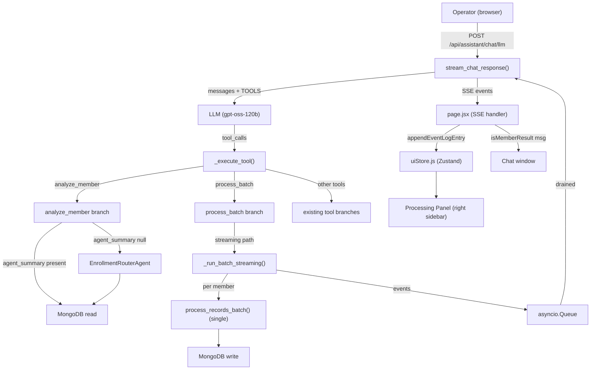

# Design Document: Chat Agent Orchestrator

## Overview

The Chat Agent Orchestrator upgrades `server/ai/chat_agent.py` from a flat tool-calling loop into a proper intent-routing orchestrator. The LLM acts as the central dispatcher: it receives the user message plus the full `TOOLS` list, classifies intent, and selects which tool to invoke. `_execute_tool()` is the async dispatcher that runs the selected tool and returns a JSON result.

Three capabilities are added in this feature:

1. **`analyze_member` tool** — lets operators ask conversational questions about individual members and receive a rich AI-generated summary on demand, with caching via the stored `agent_summary` field.
2. **Per-member SSE streaming during batch processing** — `_run_batch_streaming()` emits a `thinking` event and a `member_result` event per member as the pipeline runs, so the frontend can render a live feed.
3. **Dynamic event log** — replaces the four fixed processing steps in `uiStore.js` with an append-only, timestamped event log that grows in real time as SSE events arrive.

All changes are backward-compatible. Existing SSE event types (`thinking`, `status_update`, `response`, `done`) and the background batch path (`_run_batch_in_background`) are unchanged.

---

## Architecture



The key architectural decision is that the streaming logic lives in `stream_chat_response()`, not in `_execute_tool()`. The tool executor returns a lightweight sentinel JSON (`{"status": "streaming", "batchId": ..., "memberCount": N}`) and `stream_chat_response()` detects this and drains the queue, yielding each event as SSE before continuing the LLM loop.

---

## Components and Interfaces

### Backend: `server/ai/chat_agent.py`

#### `TOOLS` list — new entry

```python
{
    "type": "function",
    "function": {
        "name": "analyze_member",
        "description": (
            "Looks up a specific member by subscriber ID and returns their current status, "
            "AI-generated enrollment summary, validation issues, and SEP context. "
            "Use when the user asks about a specific member's status, why they are in review, "
            "their SEP details, or their enrollment outcome."
        ),
        "parameters": {
            "type": "object",
            "properties": {
                "subscriber_id": {
                    "type": "string",
                    "description": "The subscriber ID to analyze (e.g. EMP00030)."
                }
            },
            "required": ["subscriber_id"]
        }
    }
}
```

#### `_extract_member_name(member_doc) -> str`

Helper that extracts a display name from a member document using the same pattern as `get_subscriber_details` and `get_clarifications`:

```python
def _extract_member_name(member_doc: dict) -> str:
    latest_date = member_doc.get("latest_update")
    snapshot = (member_doc.get("history") or {}).get(latest_date, {})
    info = snapshot.get("member_info") or {}
    return " ".join(filter(None, [info.get("first_name"), info.get("last_name")])) or "Unknown"
```

#### `_execute_tool()` — `analyze_member` branch

```python
elif name == "analyze_member":
    from db.mongo_connection import get_database
    from server.ai.agent import EnrollmentRouterAgent, build_engine_input

    db = get_database()
    subscriber_id = args.get("subscriber_id", "").strip()
    if not subscriber_id:
        return json.dumps({"error": "subscriber_id is required"})

    m = db.members.find_one({"subscriber_id": subscriber_id}, {"_id": 0})
    if not m:
        return json.dumps({"error": f"No member found with subscriber_id '{subscriber_id}'"})

    name = _extract_member_name(m)

    # Cache hit: return stored summary
    if m.get("agent_summary") is not None:
        return json.dumps({
            "subscriber_id": subscriber_id,
            "name": name,
            "status": m.get("status"),
            "agent_summary": m.get("agent_summary"),
            "validation_issues": [
                issue if isinstance(issue, dict) else {"message": issue, "severity": None}
                for issue in (m.get("validation_issues") or [])
            ],
            "sep": _build_sep_context(m),
        })

    # Cache miss: run pipeline on demand
    try:
        result = json.loads(
            await EnrollmentRouterAgent(json.dumps(build_engine_input(m)))
        )
        root_status = result.get("root_status_recommended", "In Review")
        summary = result.get("plain_english_summary")

        db.members.update_one(
            {"subscriber_id": subscriber_id},
            {"$set": {
                "agent_summary": summary,
                "status": root_status,
                "agent_analysis": result.get("agent_analysis", {}),
                "markers": result.get("markers", {}),
                "lastProcessedAt": _dt.utcnow().isoformat(),
            }}
        )
        return json.dumps({
            "subscriber_id": subscriber_id,
            "name": name,
            "status": root_status,
            "agent_summary": summary,
            "validation_issues": [
                issue if isinstance(issue, dict) else {"message": issue, "severity": None}
                for issue in (m.get("validation_issues") or [])
            ],
            "sep": _build_sep_context(m),
        })
    except Exception as e:
        return json.dumps({"error": str(e), "agent_summary": None})
```

`_build_sep_context(m)` is a small helper that extracts the same SEP object shape as `get_subscriber_details` — reusing the existing logic already present in that branch.

#### `_run_batch_streaming(batch_id, members, queue) -> None`

New async function alongside `_run_batch_in_background`:

```python
async def _run_batch_streaming(
    batch_id: str,
    members: list,
    queue: asyncio.Queue,
) -> None:
    from server.ai.agent import process_records_batch
    from db.mongo_connection import get_database

    db = get_database()
    processed = 0
    failed = 0

    for member in members:
        sid = member.get("subscriber_id", "")
        name = _extract_member_name(member)

        await queue.put({"type": "thinking", "message": f"Processing {name} ({sid})..."})

        try:
            results = await process_records_batch([member], persist=False)
            r = results[0] if results else {}
            root_status = r.get("root_status_recommended", "In Review")
            valid_statuses = {"Enrolled", "Enrolled (SEP)", "In Review", "Processing Failed"}
            if root_status not in valid_statuses:
                root_status = "In Review"
            summary = r.get("plain_english_summary")

            if db is not None:
                db.members.update_one(
                    {"subscriber_id": sid},
                    {"$set": {
                        "agent_summary": summary,
                        "status": root_status,
                        "agent_analysis": r.get("agent_analysis", r),
                        "markers": r.get("markers", {}),
                        "lastProcessedAt": _dt.utcnow().isoformat(),
                    }}
                )
            processed += 1
            await queue.put({
                "type": "member_result",
                "subscriber_id": sid,
                "name": name,
                "status": root_status,
                "summary": summary,
            })
        except Exception as e:
            failed += 1
            await queue.put({
                "type": "member_result",
                "subscriber_id": sid,
                "name": name,
                "status": "Processing Failed",
                "summary": str(e),
            })

    await queue.put(None)  # sentinel

    if db is not None:
        db.batches.update_one(
            {"id": batch_id},
            {"$set": {
                "status": "Completed",
                "processedCount": processed,
                "failedCount": failed,
                "completedAt": _dt.utcnow().isoformat(),
            }}
        )
```

#### `_execute_tool()` — `process_batch` branch (streaming sentinel)

The existing `process_batch` branch is modified to return a streaming sentinel instead of firing `_run_batch_in_background`. The `asyncio.create_task(_run_batch_in_background(...))` call is replaced with:

```python
return json.dumps({
    "status": "streaming",
    "batchId": batch_id,
    "memberCount": len(members_in_batch),
    "_members": members_in_batch,
})
```

`stream_chat_response()` detects `status == "streaming"` in the tool result and runs the drain loop. The `_members` key is an internal transport mechanism stripped before the result is forwarded to the LLM message history.

#### `stream_chat_response()` — streaming drain loop

After `_execute_tool()` returns for `process_batch`:

```python
parsed_result = json.loads(tool_result)
if parsed_result.get("status") == "streaming":
    batch_id = parsed_result["batchId"]
    members_in_batch = parsed_result.pop("_members", [])
    queue = asyncio.Queue()
    asyncio.create_task(_run_batch_streaming(batch_id, members_in_batch, queue))

    stream_processed = 0
    stream_failed = 0
    while True:
        event = await queue.get()
        if event is None:
            break
        yield send_event(event)
        if event.get("type") == "member_result":
            if event.get("status") == "Processing Failed":
                stream_failed += 1
            else:
                stream_processed += 1

    yield send_event({
        "type": "status_update",
        "message": (
            f"Batch complete — {stream_processed} enrolled, "
            f"{stream_failed} failed."
        ),
        "details": {
            "batchId": batch_id,
            "processed": stream_processed,
            "failed": stream_failed,
        },
    })
    # Strip _members before appending to LLM message history
    tool_result = json.dumps({
        "status": "completed",
        "batchId": batch_id,
        "processed": stream_processed,
        "failed": stream_failed,
    })
```

#### `stream_chat_response()` — richer thinking events

```python
entity_hint = ""
if tool_name == "analyze_member":
    entity_hint = f" — member {tool_args.get('subscriber_id', '')}"
elif tool_name == "process_batch":
    entity_hint = f" — batch {tool_args.get('batch_id', 'pending')}"
elif tool_name == "get_subscriber_details":
    entity_hint = f" — {tool_args.get('subscriber_id', '')}"

yield send_event({
    "type": "thinking",
    "message": f"Running: {tool_name.replace('_', ' ')}{entity_hint}...",
})
```

#### `SYSTEM_PROMPT` additions

The following routing rules are appended to the existing `SYSTEM_PROMPT`:

```
- Call analyze_member when the user asks about a specific member by name or subscriber ID,
  asks why someone is in review, asks about SEP details for a member, or asks about a
  member's enrollment outcome. analyze_member returns agent_summary which is a
  plain-English explanation — use it directly in your response.
- For batch processing requests, use process_batch (streaming results will appear
  automatically in the chat window as each member is processed).
- Prefer analyze_member over get_subscriber_details when the user wants an explanation
  of why a member is in their current status, not just raw field data.
```

---

### Backend: `server/ai/agent.py`

No changes to `agent.py`. `EnrollmentRouterAgent` and `process_records_batch` are called directly from `chat_agent.py` as described above.

---

### Frontend: `client/src/store/uiStore.js`

#### State changes

| Before | After |
|--------|-------|
| `INITIAL_STEPS` constant (4-item array) | Removed |
| `chatProcessSteps: INITIAL_STEPS` | `chatProcessSteps: []` (same key, empty initial value) |
| `updateChatStep(id, status, detail)` — mutates steps | No-op stub |
| `resetChatSteps()` — resets to `INITIAL_STEPS` | Delegates to `resetEventLog()` |
| — | `appendEventLogEntry(entry)` — appends to `chatProcessSteps` |
| — | `resetEventLog()` — sets `chatProcessSteps: []`, `chatIsProcessing: false` |

The state key name `chatProcessSteps` is preserved so all existing read references in `page.jsx` continue to work without modification.

#### New actions

```javascript
appendEventLogEntry: (entry) =>
  set((state) => ({
    chatProcessSteps: [...state.chatProcessSteps, entry],
  })),

resetEventLog: () =>
  set({ chatProcessSteps: [], chatIsProcessing: false }),

// Backward-compat stubs
updateChatStep: () => {},
resetChatSteps: () => get().resetEventLog(),
```

`startNewConversation`, `switchConversation`, and `clearChat` are updated to reset `chatProcessSteps` to `[]` instead of `INITIAL_STEPS`.

#### `Event_Log_Entry` shape

```typescript
{
  id: string,           // generateId()
  timestamp: string,    // new Date().toISOString()
  eventType: "thinking" | "tool" | "result" | "member_result",
  message: string,
}
```

---

### Frontend: `client/src/app/ai-assistant/page.jsx`

#### SSE event handler additions

```javascript
// Destructure new actions from store
const { appendEventLogEntry, resetEventLog } = useUIStore();

// In streamLLMChat, replace resetChatSteps() with resetEventLog()

// Switch cases:
case 'thinking':
  appendEventLogEntry({
    id: generateId(),
    timestamp: new Date().toISOString(),
    eventType: 'thinking',
    message: payload.message,
  });
  break;

case 'status_update':
  appendEventLogEntry({
    id: generateId(),
    timestamp: new Date().toISOString(),
    eventType: 'tool',
    message: payload.message,
  });
  setChatMessages((prev) => [
    ...prev,
    {
      id: generateId(),
      role: 'ai',
      text: payload.message,
      isStatusUpdate: true,
      details: payload.details,
      timestamp: new Date().toISOString(),
    },
  ]);
  break;

case 'member_result':
  appendEventLogEntry({
    id: generateId(),
    timestamp: new Date().toISOString(),
    eventType: 'member_result',
    message: `${payload.name}: ${payload.status} — ${payload.summary || 'No summary available'}`,
  });
  setChatMessages((prev) => [
    ...prev,
    {
      id: generateId(),
      role: 'ai',
      isMemberResult: true,
      subscriber_id: payload.subscriber_id,
      name: payload.name,
      status: payload.status,
      summary: payload.summary,
      timestamp: new Date().toISOString(),
    },
  ]);
  break;

case 'response':
  appendEventLogEntry({
    id: generateId(),
    timestamp: new Date().toISOString(),
    eventType: 'result',
    message: 'Response generated',
  });
  // existing response handling unchanged...
  break;
```

The existing `updateChatStep` calls in the `thinking` and `status_update` handlers are removed (the store stubs them as no-ops, but removing them keeps the code clean).

#### Processing Panel rendering

The right sidebar `<aside>` is updated to render the event log instead of the fixed step list:

```jsx
<div className={styles.processingBody} ref={logContainerRef}>
  {chatProcessSteps.length === 0 && !chatIsProcessing ? (
    <div className={styles.emptyLog}>Waiting for activity...</div>
  ) : (
    chatProcessSteps.map((entry) => (
      <div key={entry.id} className={styles.logEntry}>
        <span className={styles.logTimestamp}>
          {new Date(entry.timestamp).toLocaleTimeString([], {
            hour: '2-digit', minute: '2-digit', second: '2-digit', hour12: false,
          })}
        </span>
        <span className={`${styles.logBadge} ${styles['badge_' + entry.eventType]}`}>
          {entry.eventType}
        </span>
        <span className={styles.logMessage}>{entry.message}</span>
      </div>
    ))
  )}
  <div ref={logEndRef} />
</div>
```

Auto-scroll is achieved with a `useEffect` that calls `logEndRef.current?.scrollIntoView({ behavior: 'smooth' })` whenever `chatProcessSteps` changes.

#### Member result card rendering

```jsx
{msg.isMemberResult && (
  <div className={styles.memberCard}>
    <div className={styles.memberCardHeader}>
      <span className={styles.memberName}>{msg.name}</span>
      <span className={styles.memberSubId}>{msg.subscriber_id}</span>
    </div>
    <span className={`${styles.statusBadge} ${styles[statusBadgeClass(msg.status)]}`}>
      {msg.status}
    </span>
    <p className={styles.memberSummary}>
      {msg.summary || 'No summary available'}
    </p>
    <div className={styles.timestamp}>{formatTime(msg.timestamp)}</div>
  </div>
)}
```

`statusBadgeClass(status)` maps:
- `"Enrolled"` / `"Enrolled (SEP)"` → `badgeGreen`
- `"In Review"` → `badgeAmber`
- `"Processing Failed"` → `badgeRed`

---

## Data Models

### `Event_Log_Entry` (frontend, in-memory only)

```typescript
interface EventLogEntry {
  id: string;           // random 9-char alphanumeric
  timestamp: string;    // ISO 8601
  eventType: "thinking" | "tool" | "result" | "member_result";
  message: string;
}
```

### `member_result` SSE event

```typescript
interface MemberResultEvent {
  type: "member_result";
  subscriber_id: string;
  name: string;
  status: "Enrolled" | "Enrolled (SEP)" | "In Review" | "Processing Failed";
  summary: string | null;
}
```

### `analyze_member` tool response

```typescript
interface AnalyzeMemberResponse {
  subscriber_id: string;
  name: string;
  status: string;
  agent_summary: string | null;
  validation_issues: Array<{ message: string; severity: string | null }>;
  sep: {
    sep_type: string;
    sep_confidence: number | null;
    supporting_signals: string[];
    other_candidates: any[];
    is_within_oep: boolean | null;
    evidence_status: string;
    required_docs: string[];
    submitted_docs: string[];
    missing_docs: string[];
    evidence_complete: boolean | null;
  } | null;
}
```

### MongoDB member document — fields written by `analyze_member` and `_run_batch_streaming`

Both paths write the same five fields via `$set`:

| Field | Type | Description |
|-------|------|-------------|
| `agent_summary` | `string \| null` | Plain-English summary from `DecisionAgent` |
| `status` | `string` | Terminal status from pipeline |
| `agent_analysis` | `object` | Full pipeline analysis object |
| `markers` | `object` | SEP markers, enrollment path, evidence status |
| `lastProcessedAt` | `string` | UTC ISO timestamp |

---

## Correctness Properties

*A property is a characteristic or behavior that should hold true across all valid executions of a system — essentially, a formal statement about what the system should do. Properties serve as the bridge between human-readable specifications and machine-verifiable correctness guarantees.*

### Property 1: analyze_member cache hit never invokes the pipeline

*For any* member document where `agent_summary` is a non-null string, calling `analyze_member` with that member's `subscriber_id` SHALL return the stored `agent_summary` and SHALL NOT invoke `EnrollmentRouterAgent`.

**Validates: Requirements 1.3**

### Property 2: analyze_member cache miss invokes and persists the pipeline

*For any* member document where `agent_summary` is null or absent, calling `analyze_member` SHALL invoke `EnrollmentRouterAgent`, persist the result to MongoDB (`agent_summary`, `status`, `agent_analysis`, `markers`, `lastProcessedAt`), and return the freshly computed summary.

**Validates: Requirements 1.4**

### Property 3: analyze_member response always contains all required fields

*For any* valid `subscriber_id` that exists in MongoDB, the JSON object returned by `analyze_member` SHALL contain all six required fields: `subscriber_id`, `name`, `status`, `agent_summary`, `validation_issues`, and `sep`.

**Validates: Requirements 1.2**

### Property 4: analyze_member not-found returns correct error shape

*For any* `subscriber_id` that does not exist in MongoDB, `analyze_member` SHALL return a JSON object with an `error` field whose value is `"No member found with subscriber_id '<id>'"`.

**Validates: Requirements 1.5**

### Property 5: _run_batch_streaming emits exactly N member_result events for N members

*For any* list of N members passed to `_run_batch_streaming()`, exactly N `member_result` events SHALL be put onto the queue — one per member, regardless of whether processing succeeds or fails.

**Validates: Requirements 3.3, 3.7**

### Property 6: _run_batch_streaming sentinel is always last

*For any* list of members passed to `_run_batch_streaming()`, the sentinel value `None` SHALL always be the last item put onto the queue, after all `member_result` events.

**Validates: Requirements 3.4**

### Property 7: member_result status is always a valid terminal status

*For any* member processed in `_run_batch_streaming()`, the `status` field in the `member_result` event SHALL be one of: `"Enrolled"`, `"Enrolled (SEP)"`, `"In Review"`, `"Processing Failed"`.

**Validates: Requirements 4.3**

### Property 8: _run_batch_streaming error resilience

*For any* batch where one or more members raise an exception during processing, `_run_batch_streaming()` SHALL put a `member_result` event with `status = "Processing Failed"` for the failing member AND SHALL continue processing all remaining members in the list.

**Validates: Requirements 3.7**

### Property 9: appendEventLogEntry always grows the log by exactly one

*For any* `Event_Log_Entry` object and any current state of `chatProcessSteps`, calling `appendEventLogEntry(entry)` SHALL increase `chatProcessSteps.length` by exactly 1.

**Validates: Requirements 5.2**

### Property 10: resetEventLog always produces an empty log with chatIsProcessing false

*For any* state of `chatProcessSteps` (including non-empty logs) and any value of `chatIsProcessing`, calling `resetEventLog()` SHALL result in `chatProcessSteps.length === 0` AND `chatIsProcessing === false`.

**Validates: Requirements 5.3, 5.6**

### Property 11: updateChatStep is a safe no-op

*For any* arguments passed to `updateChatStep(id, status, detail)`, the function SHALL NOT throw an error AND SHALL NOT modify `chatProcessSteps`.

**Validates: Requirements 5.4, 8.4**

---

## Error Handling

### `analyze_member` errors

| Condition | Behavior |
|-----------|----------|
| `subscriber_id` not provided | Return `{"error": "subscriber_id is required"}` |
| Member not found in MongoDB | Return `{"error": "No member found with subscriber_id '<id>'"}` |
| MongoDB unavailable | Return `{"error": "Database not available"}` |
| `EnrollmentRouterAgent` raises exception | Return `{"error": "<exception message>", "agent_summary": null}` |

The LLM receives the error JSON as the tool result and is expected to relay it to the user in natural language.

### `_run_batch_streaming` errors

Per-member exceptions are caught and converted to `member_result` events with `status = "Processing Failed"` and `summary = str(exception)`. The batch continues processing remaining members. The batch document in MongoDB is updated with the final `processedCount` and `failedCount` regardless of per-member failures.

If the entire `_run_batch_streaming` coroutine raises an unhandled exception (e.g. the queue itself fails), the sentinel `None` may not be put on the queue. `stream_chat_response()` should apply a timeout on `queue.get()` to avoid hanging indefinitely — a 5-minute timeout per member is a reasonable guard.

### Frontend SSE errors

The existing error handler in `streamLLMChat` catches `AbortError` (user cancelled) and all other fetch errors, appending an error message to the chat. This path is unchanged. `member_result` events that arrive after an abort are silently dropped because the reader loop has exited.

### uiStore backward compatibility

`updateChatStep` is a no-op stub — any existing call site that passes `id`, `status`, and `detail` will not throw. `resetChatSteps` delegates to `resetEventLog()`. Persisted `chatHistory` from sessions that used the old four-step model will hydrate correctly because `chatProcessSteps` is excluded from `partialize` and is not persisted to localStorage.

---

## Testing Strategy

### Unit tests

- `_extract_member_name(doc)` — verify name extraction from various snapshot shapes (missing history, missing member_info, partial names).
- `_build_sep_context(doc)` — verify SEP object shape for members with and without SEP markers.
- `analyze_member` branch in `_execute_tool()` — mock MongoDB and `EnrollmentRouterAgent`; test cache hit, cache miss, not-found, and exception paths.
- `_run_batch_streaming()` — mock `process_records_batch` and MongoDB; test normal path, per-member exception, empty member list.
- `statusBadgeClass(status)` in `page.jsx` — verify correct CSS class for each of the four terminal statuses.
- `uiStore` actions — `appendEventLogEntry`, `resetEventLog`, `updateChatStep` (no-op), `resetChatSteps` (delegates).

### Property-based tests

Property-based testing is appropriate here because the feature contains pure functions and data-transformation logic (tool response construction, queue event sequencing, store state mutations) where input variation meaningfully exercises edge cases.

**Library**: [Hypothesis](https://hypothesis.readthedocs.io/) for Python backend tests; [fast-check](https://fast-check.dev/) for JavaScript frontend tests.

**Minimum iterations**: 100 per property test.

**Tag format**: `# Feature: chat-agent-orchestrator, Property N: <property_text>`

| Property | Test file | What varies |
|----------|-----------|-------------|
| P1: cache hit never invokes pipeline | `tests/test_analyze_member.py` | member doc fields, agent_summary content |
| P2: cache miss invokes and persists | `tests/test_analyze_member.py` | member doc fields, pipeline result shape |
| P3: response always has required fields | `tests/test_analyze_member.py` | member doc shape, SEP presence |
| P4: not-found error shape | `tests/test_analyze_member.py` | subscriber_id strings |
| P5: N members → N member_result events | `tests/test_batch_streaming.py` | member list length (1–20), member field values |
| P6: sentinel always last | `tests/test_batch_streaming.py` | member list length, exception injection |
| P7: status always valid terminal | `tests/test_batch_streaming.py` | pipeline result variations |
| P8: error resilience | `tests/test_batch_streaming.py` | which members fail, exception types |
| P9: appendEventLogEntry grows log by 1 | `tests/test_ui_store.js` | entry content, initial log state |
| P10: resetEventLog clears log | `tests/test_ui_store.js` | log length, chatIsProcessing state |
| P11: updateChatStep is safe no-op | `tests/test_ui_store.js` | id, status, detail arguments |

### Integration tests

- `process_batch` in `stream_chat_response()` uses the streaming path (not `_run_batch_in_background`).
- `reprocess_in_review` still uses `_run_batch_in_background` (backward compat).
- SSE event handler in `page.jsx` correctly maps each event type to `appendEventLogEntry` with the right `eventType`.

### Smoke tests

- `TOOLS` list contains `analyze_member` with correct parameter schema.
- `SYSTEM_PROMPT` contains routing rules for `analyze_member`.
- `_run_batch_in_background` function signature is unchanged.
- `chatProcessSteps` initial value is `[]`.
