# Design Document: Recon Agent

## Overview

The Recon Agent (`ReconAgent`) is a new async agent in the enrollment intelligence system that closes the loop between what the `EnrollmentClassifierAgent` detects and what actually persists in MongoDB. Currently, semantic flags like `exact_resend_or_duplicate` and `status_only_change` are computed but never acted upon — they exist only in the diff explainability output and are never written back to the member record.

`ReconAgent` fills this gap by scanning member records, running three detection passes (duplicate snapshot, status-only resend, cross-record duplicate), writing structured `markers.recon` flags atomically to MongoDB, and returning a structured JSON result that the router and batch endpoints can consume without additional logic.

The agent follows the same `async def AgentName(query: str, **kwargs) -> str` contract as every other agent in `agent.py` and is registered in `executor_dict`. It does **not** go through the Distiller pipeline — it reads directly from MongoDB and writes back, making it a standalone reconciliation pass that can be triggered on demand or on a schedule.

### Key Design Decisions

- **Direct MongoDB access** (not Distiller): Recon is a data-scan operation, not an LLM inference task. Routing it through Distiller would add latency and cost with no benefit.
- **Three-pass detection**: Each detection type is isolated so failures in one pass do not block others.
- **No root `status` mutation**: The agent writes only to `markers.recon`. The caller (router endpoint or batch job) is responsible for applying `recon_status_recommended` to the root `status` field.
- **Idempotent overwrites**: Each run overwrites `markers.recon` entirely, so re-runs on unchanged data produce identical results (excluding timestamps).
- **Error isolation per record**: A MongoDB write failure for one record is captured in the `errors` list; processing continues for all remaining records.

---

## Architecture

### Component Diagram

```mermaid
graph TD
    subgraph "Trigger Layer"
        A[POST /api/recon<br/>ReconRouter] 
        B[Chat Agent<br/>tool call]
    end

    subgraph "Agent Layer — agent.py"
        C[ReconAgent<br/>async def ReconAgent&#40;query, **kwargs&#41;]
        D[EnrollmentRouterAgent<br/>existing]
        E[executor_dict<br/>ReconAgent registered]
    end

    subgraph "Detection Passes"
        F[Pass 1: Duplicate Snapshot<br/>_deep_diff&#40;snap_a, snap_b&#41; == &#91;&#93;]
        G[Pass 2: Status-Only Resend<br/>non_status_diffs == &#91;&#93;]
        H[Pass 3: Cross-Record Duplicate<br/>group by &#40;name, dob, ssn&#41;]
    end

    subgraph "Persistence Layer"
        I[MongoDB members collection<br/>$set markers.recon]
    end

    subgraph "Helpers — already in agent.py"
        J[_deep_diff&#40;a, b&#41;]
        K[_get_latest_two_snapshots&#40;record&#41;]
        L[_sorted_history_dates&#40;record&#41;]
        M[_utc_now_z&#40;&#41;]
    end

    A --> C
    B --> C
    C --> E
    C --> F
    C --> G
    C --> H
    F --> J
    F --> K
    G --> J
    G --> K
    H --> I
    F --> I
    G --> I
    C --> I
    D -.->|semantic flags computed<br/>but not persisted today| C
```



### Position in the Pipeline

`ReconAgent` sits **after** the enrollment pipeline, not inside it. The existing flow is:

```
EDI Ingest → Business Validation → EnrollmentRouterAgent → Enrolled / In Review
```

Recon runs as a separate pass:

```
[Any time] → ReconAgent → markers.recon written → caller applies recon_status_recommended
```

This separation means recon can be triggered:
1. On demand via `POST /api/recon`
2. As a scheduled job (cron)
3. From the chat agent via `executor_dict`

---

## Components and Interfaces

### ReconAgent Function

```python
async def ReconAgent(query: str, **kwargs) -> str
```

**Input** (`query` is a JSON string):

```json
{ "subscriber_ids": ["SUB001", "SUB002"] }
```
or
```json
{ "scope": "all" }
```

**Output** (JSON string):

```json
{
  "results": [
    {
      "subscriber_id": "SUB001",
      "recon_flag": "exact_resend_or_duplicate",
      "recon_status_recommended": "Duplicate — Suppressed",
      "recon_markers": { ... }
    }
  ],
  "summary": {
    "total_processed": 1,
    "duplicates_suppressed": 1,
    "status_only_resends": 0,
    "cross_record_duplicates": 0,
    "errors_count": 0,
    "run_at": "2026-04-22T10:00:00Z"
  },
  "errors": []
}
```

### ReconRouter Endpoint

```
POST /api/recon
```

Defined in `server/routers/recon.py`, registered in `server/main.py`. Accepts the same JSON body as `ReconAgent` and returns the agent's output directly.

### executor_dict Registration

```python
executor_dict = {
    ...existing agents...,
    "ReconAgent": ReconAgent,
}
```

---

## Data Models

### ReconFlag Schema

Written to `markers.recon` on every processed record via a single `$set`:

```python
@dataclass
class ReconFlag:
    flag: str                          # "exact_resend_or_duplicate" | "status_only_change" |
                                       # "cross_record_duplicate" | "first_snapshot_only" |
                                       # "incomplete_identity_fields" | "clean"
    recon_status_recommended: str      # "Duplicate — Suppressed" | "In Review" | existing status
    recon_run_at: str                  # UTC ISO-8601, always present
    recon_version: str                 # "1.0", always present

    # Populated only for exact_resend_or_duplicate:
    suppressed_at: Optional[str]       # UTC ISO-8601

    # Populated only for status_only_change:
    status_only_change_detected_at: Optional[str]  # UTC ISO-8601

    # Populated only for cross_record_duplicate:
    duplicate_group_ids: Optional[List[str]]       # all subscriber_ids in the group

    # Populated only when skipping cross-record detection:
    skip_reason: Optional[str]         # "incomplete_identity_fields"
```

**Flag precedence** (when multiple conditions could apply, highest-priority wins):

| Priority | Flag | Condition |
|----------|------|-----------|
| 1 | `exact_resend_or_duplicate` | zero diffs between latest two snapshots |
| 2 | `status_only_change` | non-status diffs are empty |
| 3 | `cross_record_duplicate` | identity match with another subscriber_id |
| 4 | `first_snapshot_only` | record has only one snapshot |
| 5 | `clean` | none of the above |

Cross-record duplicate detection runs as a separate collection-wide pass and can co-exist with per-record flags. If a record is already flagged `exact_resend_or_duplicate`, it still participates in cross-record grouping (its identity fields are still valid).

### MongoDB Document Shape (after recon write)

```json
{
  "subscriber_id": "SUB001",
  "status": "Enrolled",
  "history": { "2026-04-15": { ... }, "2026-04-22": { ... } },
  "markers": {
    "is_sep_candidate": false,
    "is_sep_confirmed": false,
    "sep_type": null,
    "evidence_status": "not_applicable",
    "enrollment_path": "OEP",
    "recon": {
      "flag": "exact_resend_or_duplicate",
      "recon_status_recommended": "Duplicate — Suppressed",
      "recon_run_at": "2026-04-22T10:00:00Z",
      "recon_version": "1.0",
      "suppressed_at": "2026-04-22T10:00:00Z"
    }
  }
}
```

### Output JSON Schema

```json
{
  "results": [
    {
      "subscriber_id": "string",
      "recon_flag": "string",
      "recon_status_recommended": "string",
      "recon_markers": {
        "flag": "string",
        "recon_status_recommended": "string",
        "recon_run_at": "string (ISO-8601)",
        "recon_version": "string",
        "suppressed_at": "string | null",
        "status_only_change_detected_at": "string | null",
        "duplicate_group_ids": ["string"] | null,
        "skip_reason": "string | null"
      }
    }
  ],
  "summary": {
    "total_processed": "integer",
    "duplicates_suppressed": "integer",
    "status_only_resends": "integer",
    "cross_record_duplicates": "integer",
    "errors_count": "integer",
    "run_at": "string (ISO-8601)"
  },
  "errors": [
    {
      "subscriber_id": "string",
      "error": "string"
    }
  ]
}
```

---

## Algorithm Design

### Pass 1: Duplicate Snapshot Detection (per-record)

Runs on each record independently using the existing `_get_latest_two_snapshots` and `_deep_diff` helpers.

```
function detect_duplicate_snapshot(record):
    latest, prev, dates = _get_latest_two_snapshots(record)

    if latest is None:
        return flag="first_snapshot_only"   # no snapshots at all

    if prev is None:
        return flag="first_snapshot_only"   # only one snapshot

    diffs = _deep_diff(prev, latest)

    if len(diffs) == 0:
        return flag="exact_resend_or_duplicate",
               recon_status="Duplicate — Suppressed",
               suppressed_at=_utc_now_z()

    return None  # not a duplicate snapshot; continue to Pass 2
```

**Edge cases:**
- Empty `history` dict → `first_snapshot_only`
- Single snapshot → `first_snapshot_only`
- Snapshots with only `_id` or metadata differences → `_deep_diff` will catch them as diffs, so they are NOT flagged as duplicates (correct behavior)

### Pass 2: Status-Only Resend Detection (per-record)

Runs only if Pass 1 did not produce a flag.

```
function detect_status_only(record):
    latest, prev, dates = _get_latest_two_snapshots(record)

    if prev is None:
        return None  # already handled by Pass 1

    diffs = _deep_diff(prev, latest)
    non_status_diffs = [
        d for d in diffs
        if not d["path"].endswith(".status") and d["path"] != "status"
    ]

    if len(diffs) > 0 and len(non_status_diffs) == 0:
        # Only status changed
        current_status = record.get("status", "")
        terminal_enrolled = {"Enrolled", "Enrolled (SEP)"}

        if current_status in terminal_enrolled:
            recon_status = current_status   # preserve
        else:
            recon_status = "In Review"

        return flag="status_only_change",
               recon_status=recon_status,
               status_only_change_detected_at=_utc_now_z()

    return None  # not status-only; continue to Pass 3
```

**Note:** The non-status filter mirrors the exact logic already used in `EnrollmentRouterAgent`'s diff explainability block, ensuring consistency.

### Pass 3: Cross-Record Duplicate Detection (collection-wide)

This pass requires a full collection scan and runs **after** per-record passes complete. It groups all records by identity tuple and flags groups with more than one distinct `subscriber_id`.

```
function detect_cross_record_duplicates(all_records):
    identity_groups = defaultdict(list)

    for record in all_records:
        latest, _, _ = _get_latest_two_snapshots(record)
        if latest is None:
            continue

        mi = latest.get("member_info") or {}
        fn = mi.get("first_name")
        ln = mi.get("last_name")
        dob = mi.get("dob")
        ssn = mi.get("ssn")

        if not all([fn, ln, dob, ssn]):
            # Mark as skipped — incomplete identity
            record["_recon_skip_cross"] = "incomplete_identity_fields"
            continue

        key = (fn.strip().lower(), ln.strip().lower(), dob, ssn)
        identity_groups[key].append(record["subscriber_id"])

    cross_record_flags = {}  # subscriber_id -> list of group members

    for key, sub_ids in identity_groups.items():
        if len(sub_ids) > 1:
            for sid in sub_ids:
                cross_record_flags[sid] = sub_ids

    return cross_record_flags
```

**Scope:** When `scope: "all"` is used, the agent fetches all records from MongoDB. When `subscriber_ids` is provided, the agent fetches only those records for per-record passes but still performs a targeted cross-record check: it fetches the identity fields of the requested records and queries MongoDB for any other records sharing those identity tuples.

**Performance note:** For large collections, the cross-record scan uses a MongoDB aggregation pipeline with `$group` on identity fields rather than loading all documents into memory. See the MongoDB Write Strategy section.

### Flag Assembly (per-record)

After all three passes, each record's final `ReconFlag` is assembled:

```
function assemble_recon_flag(record, cross_record_flags):
    # Pass 1
    result = detect_duplicate_snapshot(record)
    if result:
        return merge(result, cross_record_check(record, cross_record_flags))

    # Pass 2
    result = detect_status_only(record)
    if result:
        return merge(result, cross_record_check(record, cross_record_flags))

    # Pass 3 only
    if record["subscriber_id"] in cross_record_flags:
        return flag="cross_record_duplicate",
               recon_status="In Review",
               duplicate_group_ids=cross_record_flags[record["subscriber_id"]]

    # Clean
    return flag="clean",
           recon_status=record.get("status", "In Review")
```

**Cross-record co-existence:** A record can be both `exact_resend_or_duplicate` AND part of a cross-record group. In that case, the per-record flag takes precedence in `flag`, but `duplicate_group_ids` is still populated so the UI can surface both issues.

---

## MongoDB Write Strategy

### Atomic $set Per Record

Each record's recon findings are written with a single `$set` operation targeting only `markers.recon`. This preserves all other `markers` fields (SEP markers, evidence status, etc.) set by the enrollment pipeline.

```python
db.members.update_one(
    {"subscriber_id": subscriber_id},
    {"$set": {"markers.recon": recon_flag_dict}},
    upsert=False  # never create new records
)
```

`upsert=False` is intentional: if a `subscriber_id` is not found in MongoDB, the write silently does nothing and the record is added to the `errors` list with reason `"subscriber_not_found"`.

### Error Isolation

```python
errors = []
for record in records_to_process:
    try:
        recon_flag = assemble_recon_flag(record, cross_record_flags)
        db.members.update_one(
            {"subscriber_id": record["subscriber_id"]},
            {"$set": {"markers.recon": recon_flag}},
            upsert=False
        )
    except Exception as e:
        errors.append({
            "subscriber_id": record.get("subscriber_id"),
            "error": f"{type(e).__name__}: {str(e)}"
        })
        # continue to next record
```

### Cross-Record Aggregation Query

For `scope: "all"`, the cross-record grouping uses a MongoDB aggregation to avoid loading full documents:

```python
pipeline = [
    {
        "$project": {
            "subscriber_id": 1,
            "latest_update": 1,
            # Extract identity fields from the latest snapshot dynamically
            # (handled in Python after fetching — see note below)
        }
    }
]
```

Because the latest snapshot key is dynamic (a date string), the aggregation fetches full documents but projects only `subscriber_id`, `history`, and `latest_update`. Python then extracts the identity tuple from `history[latest_update].member_info`. This is acceptable for the current collection size; a future optimization could store a denormalized `latest_member_info` field at the root level.

### Root Status Not Modified

`ReconAgent` never writes to the root `status` field. The `recon_status_recommended` field in the output is a recommendation for the caller. The `POST /api/recon` endpoint returns the full results; the caller (UI, batch job, or chat agent) decides whether to apply the recommendation.

---

## Router Endpoint Design

### File: `server/routers/recon.py`

```python
from fastapi import APIRouter, HTTPException
from pydantic import BaseModel
from typing import List, Optional
import json

from server.ai.agent import ReconAgent

router = APIRouter(prefix="/api")


class ReconRequest(BaseModel):
    subscriber_ids: Optional[List[str]] = None
    scope: Optional[str] = None  # "all"


@router.post("/recon")
async def run_recon(req: ReconRequest):
    if not req.subscriber_ids and req.scope != "all":
        raise HTTPException(
            status_code=400,
            detail="Provide either subscriber_ids list or scope='all'"
        )

    query = {}
    if req.scope == "all":
        query = {"scope": "all"}
    else:
        query = {"subscriber_ids": req.subscriber_ids}

    result_str = await ReconAgent(json.dumps(query))
    return json.loads(result_str)
```

### Registration in `server/main.py`

```python
from server.routers import files, members, clarifications, batches, metrics, auth, recon

app.include_router(recon.router)
```

### Request / Response Contract

| Field | Type | Description |
|-------|------|-------------|
| `subscriber_ids` | `string[]` (optional) | Process specific records |
| `scope` | `"all"` (optional) | Process all records in collection |

Exactly one of `subscriber_ids` or `scope` must be provided.

**Response:** The raw JSON output of `ReconAgent` — `results`, `summary`, `errors`.

---

## Correctness Properties

*A property is a characteristic or behavior that should hold true across all valid executions of a system — essentially, a formal statement about what the system should do. Properties serve as the bridge between human-readable specifications and machine-verifiable correctness guarantees.*

### Property 1: Duplicate snapshot detection is complete and correct

*For any* member record whose latest two snapshots are byte-for-byte identical (produce zero diffs from `_deep_diff`), the recon detection logic SHALL set `flag` to `"exact_resend_or_duplicate"`, `recon_status_recommended` to `"Duplicate — Suppressed"`, and `suppressed_at` to a valid ISO-8601 UTC timestamp string.

**Validates: Requirements 1.1, 1.2, 1.3**

---

### Property 2: Single-snapshot records are skipped correctly

*For any* member record containing exactly one snapshot (regardless of its content), the recon detection logic SHALL set `flag` to `"first_snapshot_only"` and SHALL NOT set `recon_status_recommended` to `"Duplicate — Suppressed"`.

**Validates: Requirements 1.4**

---

### Property 3: Status-only resend detection is complete and correct

*For any* member record whose latest two snapshots differ only in the `status` field (all non-status diffs are empty and at least one diff exists), the recon detection logic SHALL set `flag` to `"status_only_change"` and `status_only_change_detected_at` to a valid ISO-8601 UTC timestamp string.

**Validates: Requirements 2.1, 2.4**

---

### Property 4: Status-only resend routing preserves enrolled status

*For any* member record flagged as `"status_only_change"`, if the record's current root `status` is `"Enrolled"` or `"Enrolled (SEP)"`, then `recon_status_recommended` SHALL equal the record's current `status`; otherwise `recon_status_recommended` SHALL be `"In Review"`.

**Validates: Requirements 2.2, 2.3**

---

### Property 5: Cross-record duplicate grouping is symmetric and complete

*For any* collection of member records, if two or more records share the same `(first_name, last_name, dob, ssn)` identity tuple in their latest snapshot, then ALL records in that group SHALL be flagged `"cross_record_duplicate"`, their `duplicate_group_ids` SHALL contain exactly the set of `subscriber_id` values in the group, and their `recon_status_recommended` SHALL be `"In Review"`.

**Validates: Requirements 3.1, 3.2, 3.3, 3.4**

---

### Property 6: Incomplete identity fields are skipped for cross-record detection

*For any* member record missing one or more of `first_name`, `last_name`, `dob`, or `ssn` in its latest snapshot, the cross-record detection pass SHALL skip that record and set `skip_reason` to `"incomplete_identity_fields"` rather than raising an error or producing a false positive.

**Validates: Requirements 3.5**

---

### Property 7: Every processed record output contains required fields

*For any* valid input (either `subscriber_ids` list or `scope: "all"`), every element in the `results` array SHALL contain `subscriber_id`, `recon_flag`, `recon_status_recommended`, and `recon_markers`; and `recon_markers` SHALL contain `recon_run_at` (valid ISO-8601) and `recon_version` (non-empty string).

**Validates: Requirements 4.2, 4.3, 5.1, 6.3**

---

### Property 8: Clean records preserve existing status

*For any* member record that triggers none of the three detection conditions (no duplicate snapshot, no status-only resend, no cross-record duplicate), the recon output SHALL set `recon_flag` to `"clean"` and `recon_status_recommended` to the record's existing root `status`.

**Validates: Requirements 5.4**

---

### Property 9: Summary counts are consistent with results

*For any* run of `ReconAgent`, the `summary` fields `duplicates_suppressed`, `status_only_resends`, `cross_record_duplicates`, and `errors_count` SHALL equal the count of results with the corresponding flags and the length of the `errors` list respectively, and `total_processed` SHALL equal the number of records attempted.

**Validates: Requirements 5.3**

---

### Property 10: Idempotence (excluding timestamps)

*For any* member record, running the recon detection logic twice in succession on unchanged snapshot data SHALL produce identical `markers.recon` content when timestamp fields (`recon_run_at`, `suppressed_at`, `status_only_change_detected_at`) are excluded from comparison.

**Validates: Requirements 7.1, 7.2**

---

### Property 11: Malformed input returns structured error

*For any* string that is not valid JSON, or any valid JSON object that contains neither `subscriber_ids` nor `scope`, `ReconAgent` SHALL return a valid JSON string containing `"error": "invalid_input"` and a non-empty `"message"` field rather than raising an unhandled exception.

**Validates: Requirements 6.5**

---

## Error Handling

### Input Validation

| Condition | Behavior |
|-----------|----------|
| Malformed JSON in `query` | Return `{"error": "invalid_input", "message": "..."}` |
| Neither `subscriber_ids` nor `scope` present | Return `{"error": "invalid_input", "message": "..."}` |
| `subscriber_ids` is empty list | Return empty `results`, `summary` with zeros |
| `scope` value other than `"all"` | Return `{"error": "invalid_input", "message": "..."}` |

### MongoDB Errors

| Condition | Behavior |
|-----------|----------|
| `get_database()` returns `None` | Return `{"error": "db_unavailable", "message": "..."}` immediately |
| `update_one` raises exception for a record | Add to `errors` list, continue processing |
| Record not found in collection (`upsert=False`) | Add to `errors` list with `"subscriber_not_found"` |

### Detection Errors

| Condition | Behavior |
|-----------|----------|
| Exception during `_deep_diff` for a record | Add to `errors` list, skip that record |
| Exception during cross-record grouping | Log warning, skip cross-record pass for affected records; per-record passes still run |

### Partial Failure Guarantee

The agent always returns a valid JSON string. Even if every record fails, the response is:

```json
{
  "results": [],
  "summary": { "total_processed": N, "errors_count": N, ... },
  "errors": [{ "subscriber_id": "...", "error": "..." }, ...]
}
```

---

## Testing Strategy

### Unit Tests

Focus on specific examples and edge cases for each detection function:

- `detect_duplicate_snapshot` with zero diffs → `exact_resend_or_duplicate`
- `detect_duplicate_snapshot` with one snapshot → `first_snapshot_only`
- `detect_status_only` with only status diff → `status_only_change`
- `detect_status_only` with non-status diffs → `None` (not flagged)
- `assemble_recon_flag` with enrolled status + status-only → preserves status
- `assemble_recon_flag` with non-enrolled status + status-only → `"In Review"`
- Cross-record grouping with 2 records sharing identity → both flagged
- Cross-record grouping with missing SSN → `skip_reason` set
- Malformed JSON input → `invalid_input` error response
- MongoDB unavailable → `db_unavailable` error response

### Property-Based Tests

Use [Hypothesis](https://hypothesis.readthedocs.io/) (Python) for property-based testing. Each property test runs a minimum of 100 iterations.

Tag format: `# Feature: recon-agent, Property {N}: {property_text}`

**Property 1** — Generate random member records with two identical snapshots; verify flag, status, and timestamp.

**Property 2** — Generate random member records with exactly one snapshot; verify `first_snapshot_only` flag.

**Property 3** — Generate random member records where snapshots differ only in `status`; verify flag and timestamp.

**Property 4** — Generate random member records with `status_only_change` and random current statuses; verify routing logic.

**Property 5** — Generate random collections with planted identity-matching groups; verify all group members are flagged with correct `duplicate_group_ids`.

**Property 6** — Generate random member records with missing identity fields (various combinations); verify skip behavior.

**Property 7** — Generate random valid inputs; verify output schema completeness.

**Property 8** — Generate random clean records (no issues); verify `"clean"` flag and status preservation.

**Property 9** — Generate random inputs with known distributions; verify summary counts match results.

**Property 10** — Run detection logic twice on same data; verify idempotence (excluding timestamps).

**Property 11** — Generate random malformed strings and invalid JSON objects; verify structured error response.

### Integration Tests

- `POST /api/recon` with `scope: "all"` against a test MongoDB instance with seeded data
- Verify `markers.recon` is written correctly after a run
- Verify root `status` is NOT modified by the agent
- Verify `executor_dict["ReconAgent"]` is callable and returns valid JSON
- Verify re-running on unchanged data overwrites (not appends) `markers.recon`
